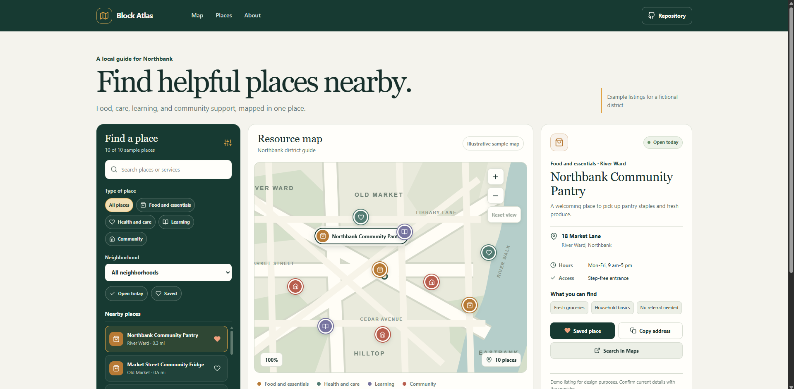

# Block Atlas - Neighborhood Resource Map

Block Atlas helps people explore nearby food, health, learning, and community resources in one place. The map, filters, place list, and detail panel work together so visitors can find a service and check the information before visiting.

**Live demo:** [https://a2rp.github.io/neighborhood-resource-map/](https://a2rp.github.io/neighborhood-resource-map/)

**Repository:** [https://github.com/a2rp/neighborhood-resource-map](https://github.com/a2rp/neighborhood-resource-map)

## What is included

- A fixed header with Map, Places, and About links, plus a visible Repository link.
- A Northbank neighborhood map drawn locally as an illustration. Each marker selects a sample listing. The plus and minus buttons zoom the map between 80% and 120%; Reset view returns it to 100%.
- Ten sample resource listings across food and essentials, health and care, learning, and community.
- A searchable directory. Search checks resource names, categories, neighborhood names, addresses, descriptions, and services.
- Filters for resource type, neighborhood, places open today, and saved places. Clear resets all filters.
- A place list that stays in sync with the filtered map. Selecting a list entry or marker updates the details panel.
- A place details panel with sample hours, access information, services, and neighborhood.
- A save control on listings and in the details panel. Saved listings remain in this browser and can be shown with the Saved filter.
- Copy address, which copies the sample address when browser clipboard access is available.
- Search in Maps, which opens an external map search for the selected sample listing.
- A responsive mobile navigation menu that closes after selection, an outside click, or Escape.
- A Back to top button that appears after scrolling more than 50 pixels and respects reduced-motion preferences.
- A footer with the local logo, current-year copyright, profile, repository, social, and support links.

## How to use it

1. Search for a service, a neighborhood, an address, or a type of help.
2. Select a type or neighborhood, or use Open today and Saved to narrow the list.
3. Choose a place from the list or select its marker on the map.
4. Review its address, hours, access notes, and services in the details panel.
5. Save a useful place, copy its address, or open a map search.

## Sample data and limits

The Northbank district and all ten listings are fictional examples included for this interface. The map is illustrative rather than a real street map, and the distances and service details are not verified. Confirm information with a real provider before traveling or relying on a service. Search in Maps sends the sample name and address to Google Maps.

The resource data and marker positions are in src/data/resources.js. Saved place IDs use the browser localStorage key block-atlas-saved. Saves are local to the current browser and device. There is no account, server storage, or cross-device sync. If browser storage is unavailable, the page keeps changes for the current session and displays a notice.

## Run locally

Use Node.js and npm from the project folder:

~~~sh
npm install
npm run dev
~~~

Vite prints the local development address in the terminal.

## Code checks and preview

~~~sh
npm run lint
npm run build
npm run preview
~~~

ESLint checks the source. The production build is written to dist. The preview command serves that production build locally.

## Deployment

This project publishes to GitHub Pages from the gh-pages branch. The npm deployment command runs the production build first:

~~~sh
npm run deploy
~~~

**Website:** [https://a2rp.github.io/neighborhood-resource-map/](https://a2rp.github.io/neighborhood-resource-map/)

## Future improvements

These are ideas for future versions and are not implemented now:

- Replace the illustrative map and example listings with verified local data and a real map provider.
- Add provider accounts so organizations can update their hours, services, and accessibility details.
- Add location-aware search, walking distances, and route directions.
- Add listing review dates, languages, and verified contact details.
- Add an optional account to sync saved places across devices.

## Links

- Portfolio: [https://www.ashishranjan.net](https://www.ashishranjan.net)
- GitHub: [https://github.com/a2rp](https://github.com/a2rp)
- CodePen: [https://codepen.io/ash1198](https://codepen.io/ash1198)
- LinkedIn: [https://www.linkedin.com/in/aashishranjan](https://www.linkedin.com/in/aashishranjan)
- Facebook: [https://www.facebook.com/theash.ashish/](https://www.facebook.com/theash.ashish/)
- YouTube: [https://www.youtube.com/@ashishranjan-ashz?sub_confirmation=1](https://www.youtube.com/@ashishranjan-ashz?sub_confirmation=1)
- Email: [mailto:ash.ranjan09@gmail.com](mailto:ash.ranjan09@gmail.com)

## Support

- Support: [https://a2rp-donation-page.netlify.app/](https://a2rp-donation-page.netlify.app/)
- Buy Me a Coffee: [https://buymeacoffee.com/ashishranjan](https://buymeacoffee.com/ashishranjan)
- Patreon: [https://www.patreon.com/ashishranjan](https://www.patreon.com/ashishranjan)